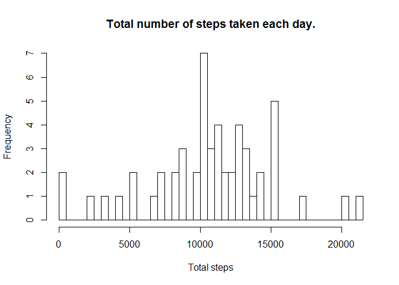
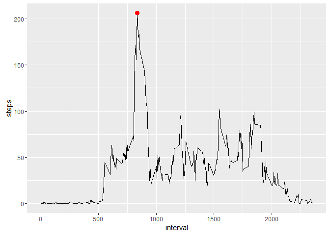
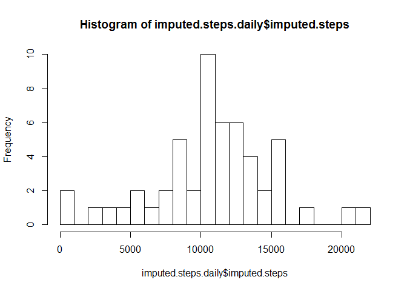
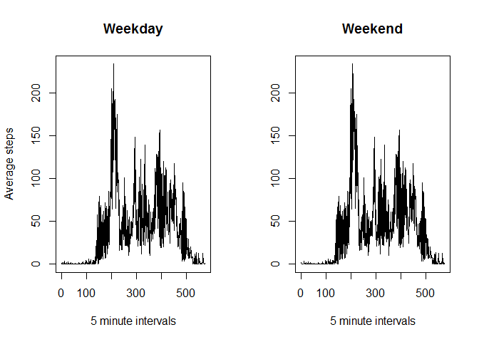

# Datascience Courswe 5, Week 2, Peer Graded Assignment
Mate Sztipanovits  
Thursday, January 05, 2017  

# Reading and formatting the data

```r
library(ggplot2)
setwd("~/Documents/My Documents/Certificates/Data Science Specialization/Course 5 - Reproducible Research/course-project-1")
values<-read.csv("activity.csv")
activity<-data.frame(steps=as.numeric(values$steps),
                     date=as.Date(values$date),
                     interval=as.numeric(values$interval))
```

# Histogram of the total number of steps taken each day

```r
total<-aggregate(steps~date,data=activity,sum)
hist(total$steps,main="Total number of steps taken each day.",
     xlab="Total steps",breaks=53)
```

<!-- -->

# Mean and median number of steps taken each day

```r
m.1<-aggregate(steps~date,data=activity,mean)
summary(m.1)
```

```
##       date                steps        
##  Min.   :2012-10-02   Min.   : 0.1424  
##  1st Qu.:2012-10-16   1st Qu.:30.6979  
##  Median :2012-10-29   Median :37.3785  
##  Mean   :2012-10-30   Mean   :37.3826  
##  3rd Qu.:2012-11-16   3rd Qu.:46.1597  
##  Max.   :2012-11-29   Max.   :73.5903
```

# Time series plot of the average number of steps taken

```r
plot(m.1$date,m.1$steps,type="l",main="Average number of steps taken",
     xlab="Date",ylab="Steps")
```

<!-- -->

# The 5-minute interval that, on average, 
# contains the maximum number of steps

The maximum number of steps is 206 and is shown by the red dot.


```r
interval.steps<-aggregate(steps~interval,data=activity,mean)
max.steps<-max(interval.steps$steps)
y.max.steps<-interval.steps$interval[interval.steps$steps==max.steps]
g<-ggplot(interval.steps,aes(interval,steps))
g+geom_line()+geom_point(aes(y=max.steps,x=y.max.steps),size=3,colour="red")
```

<!-- -->

# Code to describe and show a strategy for imputing missing data

I am imputing the missing data to be the average value. 


```r
imputed.steps <- {
        average.steps<-mean(activity$steps)
        size<-length(t(activity$steps))
        imputed.steps <- 1:size
        for(l in 1:size) {
                if (is.na(activity$steps[l])) {
                        imputed.steps[l]<-average.steps
                }
                else {
                        imputed.steps[l]<-activity$steps[l]
                }
        }
        imputed.steps
}
```

# Histogram of the total number of steps taken each day after missing
# values are imputed

```r
imputed.steps.daily<-aggregate(imputed.steps~activity$date,FUN=sum)
hist(imputed.steps.daily$imputed.steps,breaks=20)
```

<!-- -->

# Panel plot comparing the average number of steps taken per 5-minute 
# interval across weekdays and weekends

```r
weekday.activity<-weekdays(activity$date)%in%c("Monday","Tuesday","Wednesday","Thursday","Friday")
weekend.activity<-!weekday.activity
par(mfrow=c(1,2))
ave.steps.weekend<-aggregate(activity[,1]~weekend.activity+activity[,3],FUN=mean)
ave.steps.weekday<-aggregate(activity[,1]~weekday.activity+activity[,3],FUN=mean)
plot(ave.steps.weekday[,3],type="l",main="Weekday",xlab="5 minute intervals",ylab="Average steps")
plot(ave.steps.weekend[,3],type="l",main="Weekend",xlab="5 minute intervals",ylab="")
```

<!-- -->
