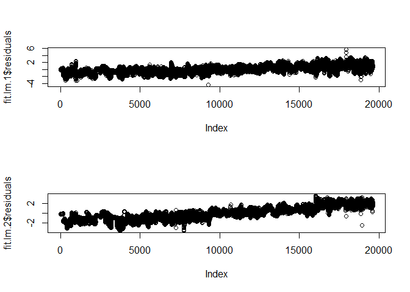
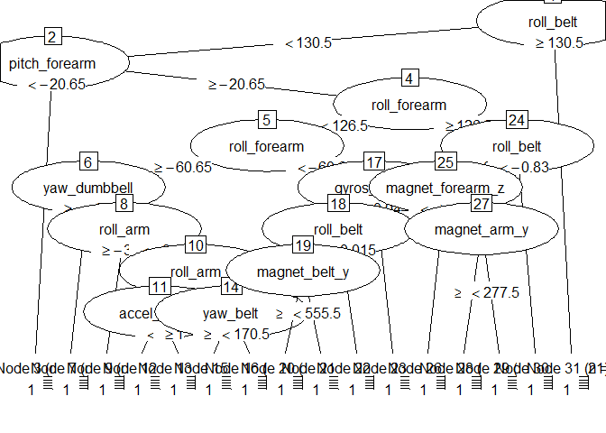

# Course Project - Machine Learning
Mate Sztipanovits  

In this project we are asked to provide an algorithm that can
forecast one of five classifications of exercise tracking device
users based on measurements of their motion.

## Exploratory Analysis

Field names and classes give us an overview of the data.
Below we see the names of the fields in the training set given to us:


```
##   [1] "X"                        "user_name"               
##   [3] "raw_timestamp_part_1"     "raw_timestamp_part_2"    
##   [5] "cvtd_timestamp"           "new_window"              
##   [7] "num_window"               "roll_belt"               
##   [9] "pitch_belt"               "yaw_belt"                
##  [11] "total_accel_belt"         "kurtosis_roll_belt"      
##  [13] "kurtosis_picth_belt"      "kurtosis_yaw_belt"       
##  [15] "skewness_roll_belt"       "skewness_roll_belt.1"    
##  [17] "skewness_yaw_belt"        "max_roll_belt"           
##  [19] "max_picth_belt"           "max_yaw_belt"            
##  [21] "min_roll_belt"            "min_pitch_belt"          
##  [23] "min_yaw_belt"             "amplitude_roll_belt"     
##  [25] "amplitude_pitch_belt"     "amplitude_yaw_belt"      
##  [27] "var_total_accel_belt"     "avg_roll_belt"           
##  [29] "stddev_roll_belt"         "var_roll_belt"           
##  [31] "avg_pitch_belt"           "stddev_pitch_belt"       
##  [33] "var_pitch_belt"           "avg_yaw_belt"            
##  [35] "stddev_yaw_belt"          "var_yaw_belt"            
##  [37] "gyros_belt_x"             "gyros_belt_y"            
##  [39] "gyros_belt_z"             "accel_belt_x"            
##  [41] "accel_belt_y"             "accel_belt_z"            
##  [43] "magnet_belt_x"            "magnet_belt_y"           
##  [45] "magnet_belt_z"            "roll_arm"                
##  [47] "pitch_arm"                "yaw_arm"                 
##  [49] "total_accel_arm"          "var_accel_arm"           
##  [51] "avg_roll_arm"             "stddev_roll_arm"         
##  [53] "var_roll_arm"             "avg_pitch_arm"           
##  [55] "stddev_pitch_arm"         "var_pitch_arm"           
##  [57] "avg_yaw_arm"              "stddev_yaw_arm"          
##  [59] "var_yaw_arm"              "gyros_arm_x"             
##  [61] "gyros_arm_y"              "gyros_arm_z"             
##  [63] "accel_arm_x"              "accel_arm_y"             
##  [65] "accel_arm_z"              "magnet_arm_x"            
##  [67] "magnet_arm_y"             "magnet_arm_z"            
##  [69] "kurtosis_roll_arm"        "kurtosis_picth_arm"      
##  [71] "kurtosis_yaw_arm"         "skewness_roll_arm"       
##  [73] "skewness_pitch_arm"       "skewness_yaw_arm"        
##  [75] "max_roll_arm"             "max_picth_arm"           
##  [77] "max_yaw_arm"              "min_roll_arm"            
##  [79] "min_pitch_arm"            "min_yaw_arm"             
##  [81] "amplitude_roll_arm"       "amplitude_pitch_arm"     
##  [83] "amplitude_yaw_arm"        "roll_dumbbell"           
##  [85] "pitch_dumbbell"           "yaw_dumbbell"            
##  [87] "kurtosis_roll_dumbbell"   "kurtosis_picth_dumbbell" 
##  [89] "kurtosis_yaw_dumbbell"    "skewness_roll_dumbbell"  
##  [91] "skewness_pitch_dumbbell"  "skewness_yaw_dumbbell"   
##  [93] "max_roll_dumbbell"        "max_picth_dumbbell"      
##  [95] "max_yaw_dumbbell"         "min_roll_dumbbell"       
##  [97] "min_pitch_dumbbell"       "min_yaw_dumbbell"        
##  [99] "amplitude_roll_dumbbell"  "amplitude_pitch_dumbbell"
## [101] "amplitude_yaw_dumbbell"   "total_accel_dumbbell"    
## [103] "var_accel_dumbbell"       "avg_roll_dumbbell"       
## [105] "stddev_roll_dumbbell"     "var_roll_dumbbell"       
## [107] "avg_pitch_dumbbell"       "stddev_pitch_dumbbell"   
## [109] "var_pitch_dumbbell"       "avg_yaw_dumbbell"        
## [111] "stddev_yaw_dumbbell"      "var_yaw_dumbbell"        
## [113] "gyros_dumbbell_x"         "gyros_dumbbell_y"        
## [115] "gyros_dumbbell_z"         "accel_dumbbell_x"        
## [117] "accel_dumbbell_y"         "accel_dumbbell_z"        
## [119] "magnet_dumbbell_x"        "magnet_dumbbell_y"       
## [121] "magnet_dumbbell_z"        "roll_forearm"            
## [123] "pitch_forearm"            "yaw_forearm"             
## [125] "kurtosis_roll_forearm"    "kurtosis_picth_forearm"  
## [127] "kurtosis_yaw_forearm"     "skewness_roll_forearm"   
## [129] "skewness_pitch_forearm"   "skewness_yaw_forearm"    
## [131] "max_roll_forearm"         "max_picth_forearm"       
## [133] "max_yaw_forearm"          "min_roll_forearm"        
## [135] "min_pitch_forearm"        "min_yaw_forearm"         
## [137] "amplitude_roll_forearm"   "amplitude_pitch_forearm" 
## [139] "amplitude_yaw_forearm"    "total_accel_forearm"     
## [141] "var_accel_forearm"        "avg_roll_forearm"        
## [143] "stddev_roll_forearm"      "var_roll_forearm"        
## [145] "avg_pitch_forearm"        "stddev_pitch_forearm"    
## [147] "var_pitch_forearm"        "avg_yaw_forearm"         
## [149] "stddev_yaw_forearm"       "var_yaw_forearm"         
## [151] "gyros_forearm_x"          "gyros_forearm_y"         
## [153] "gyros_forearm_z"          "accel_forearm_x"         
## [155] "accel_forearm_y"          "accel_forearm_z"         
## [157] "magnet_forearm_x"         "magnet_forearm_y"        
## [159] "magnet_forearm_z"         "classe"
```

The initial seven fields should be cut off because they are not relevant to 
to our task of predictive modelling. 

## Data Cleaning

In order to make my computations possible I included as much of the records 
as I could while staying with numeric and available values. I removed the 
first seven variables because they are not pertinent to model building.
I then removed variables that contained missing values because the results
of many statistical operations are extend them producing not available 
results. 

Also, in preparation for cross validation I sampled the training
set into two parts.


## Formula Fitting

I selected two formulas and three models to fit to the data set for
my model building process for a total of four model fits.

I constructed two linear, a single tree and a model tree representation 
to describe the training set and used cross validation for assessment 
before making my selection.

The first linear model assumed that all
the variables in the data set were independent. In the second linear model
I adjusted the formula to account interaction terms of groupings
of records that had an x-y-z dimensionality. I also tried to fit a single
(probability) tree and a model tree to the data.

The following plots show an overview of the linear models and the
single tree model (probability tree):

<!-- --><!-- -->

Next is a quick summary of the model tree:


```
## 
## === Summary ===
## 
## Correlation coefficient                  0.9874
## Mean absolute error                      0.1208
## Root mean squared error                  0.2393
## Relative absolute error                  9.2632 %
## Root relative squared error             16.2166 %
## Total Number of Instances            19622
```

I then used cross validation to minimize my out of sample error by using the fitted models
to make a prediction on the *classe* variable on the resampled set.
I compared the predicted results with the values that were available.
To quantify the out of sample error rate of the fit I subtracted the
number of wrongly predicted divided by the total number available from one.

Results of the prediction capability of each model can be seen displayed
in the confusion matrix which tabulates guesses by available values,
(some fitted predictions exceed the range of available values):


Confusion matrix for linear model with all independent variables:

```
##     
##         1    2    3    4    5
##   -1   12    0    0    0    1
##   0   107   11    0    0    1
##   1  2137  187    6    1    1
##   2  2413 1394  723  333  163
##   3   878 1888 2209 1560 1095
##   4    33  315  478 1236 1438
##   5     0    1    6   86  658
##   6     0    1    0    0  218
##   7     0    0    0    0   31
##   8     0    0    0    0    1
```
Confusion matrix for linear model with some interaction variables:

```
##    
##        1    2    3    4    5
##   1 1015   20    5    0    7
##   2 2435  936  763  207  453
##   3 1896 2489 2525 2100 2444
##   4  234  330  129  894  655
##   5    0   17    0   15   46
##   6    0    5    0    0    1
##   7    0    0    0    0    1
```
Confusion matrix for single tree fit:

```
##    
##        1    2    3    4    5
##   1 3699  917   31   82    9
##   2 1205  731  270   12   19
##   3  570 1628 2296 1539  444
##   4   92  521  825 1442 1124
##   5   14    0    0  141 2011
```
Confusion matrix for model tree fit:

```
##    
##        1    2    3    4    5
##   1 5378   12    0    1    0
##   2  179 3552   40    2    2
##   3   20  218 3331  119   22
##   4    3   15   51 3080  246
##   5    0    0    0   14 3332
##   6    0    0    0    0    5
```

The model tree had the lowest out of sample error as shown below: 

Out of sample error rate for linear model with all independent variables:

```
## [1] 0.6109469
```
Out of sample error rate for linear model with some interaction variables:

```
## [1] 0.7239833
```
Out of sample error rate for single tree fit:

```
## [1] 0.4812455
```
Out of sample error rate for model tree fit:

```
## [1] 0.04836408
```

## Predictions

I applied the selected model tree fit, M5P, to the testing set.

Prediction on our testing set came out to be: 


```
##  [1] B A B A A E D D A A B C B A E D A D B B
## Levels: A B C D E
```
